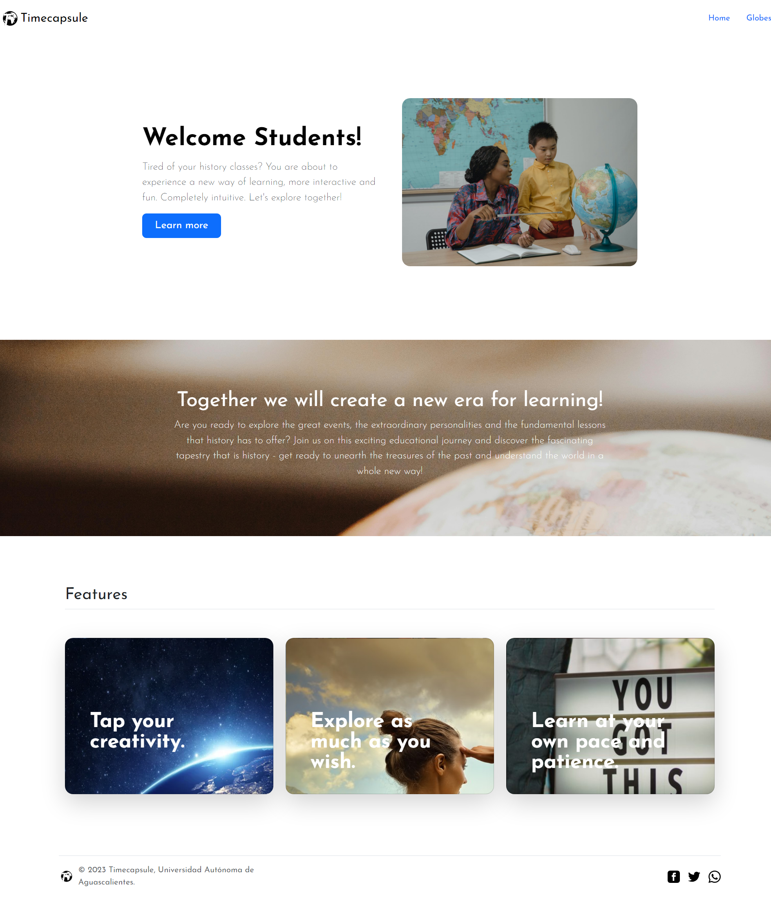

# Timecapsule 🌎

TimeCapsule es un proyecto de tesina que ofrece una página de aprendizaje a través de un globo terráqueo 3D interactivo. Explora el mundo, descubre datos geográficos y sumérgete en una experiencia educativa única. 📚


## Tecnologías


## Instalación

Para hacer un deploy correcto de este proyecto sigue los siguientes pasos:

Instalará las dependencias de Node.js

```bash
  npm run i
```
Corregir las dependencias obsoletas.

```bash
  npm audit fix --force
```

Por último.

```bash
  ng serve
```


## Feedback

Si tienes alguna recomendación, duda, aclaración no dudes en contactarme: marmolejx@gmail.com


## License

[MIT](https://choosealicense.com/licenses/mit/)


## Screenshots

<div>
  
</div>

